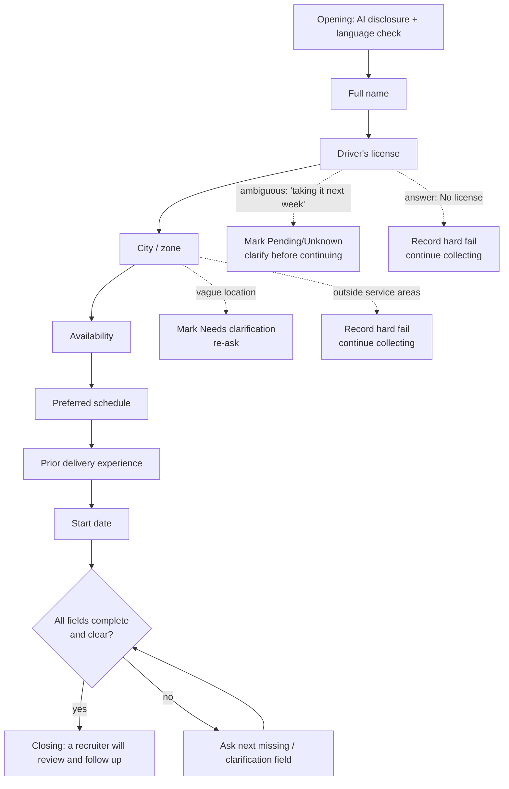

# Phase 1: Screening Process Design

**Client:** Grupo Sazón (delivery-driver hiring, 45 locations across Spain and Mexico)

**Agent:** "Lucia", a bilingual (ES/EN) AI screening assistant that runs the first-contact
chat over a messaging channel (designed for WhatsApp), collects the seven required
screening fields, and hands a triaged, summarized candidate to a human recruiter.

**Goal.** Solve the two stated problems. First, 60% of candidates don't answer phone calls,
so I screen asynchronously over messaging, on the candidate's schedule. Second, 80% of
recruiter time goes to unqualified candidates, so the agent collects and validates the hard
requirements up front and labels each candidate `eligible / not_eligible / needs_review`
before a human ever looks.

## Regulatory frame (why these constraints exist)

I treated this as a regulated use case from the start, not as an afterthought, because under
the EU AI Act recruitment and candidate-selection systems are classified as **high-risk**.
That classification, together with GDPR, drove several of the design choices below, and I
call them out where they apply:

- **No solely-automated rejection.** GDPR Article 22 gives a candidate the right not to be
  subject to a decision based solely on automated processing that significantly affects them.
  Declining a job application qualifies. So Lucia never accepts, rejects, or excludes anyone:
  she screens and labels, and a human recruiter makes every real decision. The triage label
  is decision *support*, not a decision.
- **Human oversight by construction.** The high-risk regime expects meaningful human
  oversight. The recruiter sees the full transcript and can overturn any label, and the
  agent can never upgrade a hard-fail to `eligible` on its own (see Outcomes).
- **Transparency.** Lucia discloses she is an AI in her first message, in line with the AI
  Act's transparency duty for systems that interact with people.
- **Data minimization.** GDPR Article 5(1)(c): I collect only job-relevant basics and never
  ask for ID numbers, passport, visa, email, or phone.
- **Non-discrimination.** The recruiter-facing summary is explicitly barred from inferring
  protected attributes (age, nationality, immigration status, family or health status,
  religion), so the output a human reads stays fair and defensible.
- **Traceability.** Every turn is persisted and every model call is logged, which is also
  what the high-risk record-keeping expectation needs.

---

## Design principles

These four decisions shape everything below:

1. **Messaging, not a form.** Short, natural, one question at a time. The candidate can
   answer out of order, ask questions back, or switch language, and the agent adapts.
2. **Deterministic flow, generative phrasing.** A rule-based layer decides *what* to ask
   next (from the current profile state). The LLM only decides *how* to phrase it. This
   keeps the screening exhaustive and predictable while the conversation stays human, and it
   means the flow is testable without the model.
3. **The agent screens, the recruiter decides.** Lucia never accepts, rejects, or promises
   anything. Every candidate is told a recruiter will follow up. Disqualifying facts are
   recorded for the recruiter, not announced to the candidate. This is the GDPR Article 22
   choice in practice: a person stays in the loop on every outcome.
4. **Collect only job-relevant basics.** No ID numbers, passport, visa, email, or phone are
   ever requested. Lucia discloses she is an AI.

---

## Conversation stages and branching logic

Lucia opens the conversation (the candidate already applied and left a number), confirms
language, then collects seven fields in a fixed order. A clarification always jumps ahead
of the next new question. One question per message, and the agent never closes while any
field is missing or unclear.

**Field order:** full name, then driver's license, then city/zone, then availability, then
preferred schedule, then prior delivery experience, then start date.

**Branching rules:**

- **Clarifications first.** If a previously given answer is ambiguous (license `Pending` or
  `Unknown`, city `Needs clarification`), the agent resolves it before asking anything new.
- **Hard requirements never short-circuit the chat.** A "no license" or out-of-area answer
  is *recorded* as a disqualification reason, but Lucia keeps collecting the remaining fields
  and never tells the candidate they failed. Rationale: a complete profile lets the recruiter
  catch agent mistakes, re-route the candidate to a future opening or a nearby zone, and it
  preserves a respectful candidate experience. It also keeps the decision with the human, not
  the bot. The trade-off is a few extra turns per unqualified candidate. The time saving comes
  from triage, not from cutting the chat short. An early, graceful exit on hard fail is a
  reasonable alternative I would A/B.
- **Out-of-order answers are absorbed.** If a candidate volunteers several fields in one
  message, all of them are extracted, and the agent simply asks for whatever is still missing.
- **Candidate questions are answered, then redirected.** If the candidate asks something
  (pay, shifts, which cities), Lucia answers briefly within policy ("a recruiter will cover
  the details") and returns to the next screening question.

---

## Data fields and validation rules

| Field | Captured as | Validation / normalization | Disqualifies? |
|---|---|---|---|
| **Full name** | string | Must contain at least a first **and** last name (two or more alphabetic tokens), otherwise the agent asks for the surname. | No |
| **Driver's license** | `Yes / No / Pending / Unknown` (+ raw answer kept) | Yes/no/sí variants normalized. "Taking it next week" maps to `Pending`. EU-country licenses count as valid for Spain. Car, truck, and motorbike licenses are all accepted. | **`No` disqualifies** |
| **City / zone** | canonical service area (+ raw answer kept) | Must map to one of the supported areas. The LLM resolves aliases, accents, misspellings, and bilingual names (for example "Mexico City" to "Ciudad de Mexico"), and a strict check rejects anything not on the canonical list. Vague becomes `Needs clarification`, clearly outside becomes `Unsupported`. | **`Unsupported` disqualifies** |
| **Availability** | `Full-time / Part-time / Weekends` | ES/EN synonyms normalized ("tiempo completo", "fines de semana", and so on). | No |
| **Preferred schedule** | `Morning / Afternoon / Evening / Flexible` | ES/EN synonyms normalized ("mañana", "tarde", "noche", and so on). | No |
| **Prior delivery experience** | `{ years, platform }` | "no experience" or "ninguna" maps to `years = 0`, platform optional and the field counts as complete. Otherwise it needs both a number of years and a platform (Glovo, Uber Eats, and so on). | No |
| **Start date** | free text | Accepts natural phrasing ("next Monday", "September", "right away"), and the recruiter interprets the exact date. | No |

**Service areas are internal.** The supported-city list is never listed, confirmed, or
denied to the candidate. Lucia only asks where they want to work and lets the recruiter own
coverage messaging. The demo models the client's footprint exactly: 45 service-area cities
across Spain and Mexico, each with coordinates for the analytics map. The list is data-driven
and swappable, so changing coverage is a data edit, not a code change.

**Extraction is incremental and non-destructive.** After every candidate message the full
transcript is re-read into a structured profile and *merged* with what is already known, so
a later vague answer never erases a value captured earlier. The profile also carries derived
state: `missing_fields`, `clarification_fields`, `disqualification_reasons`, `is_complete`,
and `is_disqualified`. That derived state is exactly what drives the flow logic above.

---

## Edge cases

**1. Candidate stops responding mid-conversation.**
Every turn is persisted, so a conversation can be resumed from where it stopped (via a
per-candidate ID) with no loss of state. Sessions that go quiet past a threshold are surfaced
to recruiters as **stale active candidates**, tagged with the stage they dropped off at,
which doubles as drop-off analytics. *Planned extension (designed, not yet built):* an async
re-engagement nudge, one friendly follow-up after about 24h and a final one after about 72h,
in the candidate's language, then mark dormant. The synchronous chat has no scheduler today,
so re-engagement is currently a manual recruiter action driven by the stale list.

**2. Invalid or ambiguous answers.**
Three layers handle this. (a) *Normalization* maps the long tail of phrasings to canonical
values. (b) *Clarification state*: if an answer can't be resolved confidently (vague city,
"I'm getting my license soon"), the field is marked for clarification and the agent re-asks
without blaming the candidate ("just to confirm", never "I didn't understand you"). (c)
*Strict validation*: a value that can't be mapped to an allowed option (for example a city
not in the service areas) is rejected rather than guessed. The agent re-asks the same field
until it is resolved and never advances past an unclear required field.

**3. Candidate switches language (ES to EN or back).**
Lucia replies in the language of the candidate's **latest** message, defaulting to Spanish.
On code-switching within a message she follows the dominant language of that message. The
model makes this call per turn from the latest message, so the candidate can flip languages
at any point and the agent follows without comment. Separately, the conversation's overall
language is extracted as `Spanish / English / Mixed` and stored for analytics, so I can see
how much of the funnel is bilingual.

**4. Off-script, inappropriate, or out-of-policy input (guardrail).**
Lucia stays on the screening task: she won't promise pay, shifts, schedules, or visa
sponsorship, won't reveal the internal service-area list, won't collect sensitive data, and
won't make or imply a hiring decision. Off-topic or inappropriate messages get a brief,
neutral redirect back to the current question.

---

## Outcomes: qualified vs. disqualified paths

The candidate experience is identical at every outcome. Lucia thanks them and says a
**recruiter will review the information and follow up**. The differentiation happens in the
recruiter-facing layer, where each finished screening gets a triage label and a summary.

| Label | When | What the recruiter sees / does |
|---|---|---|
| **`eligible`** | All fields complete and clear, no hard-rule failure. | Top of the queue, a complete profile ready for a callback. |
| **`not_eligible`** | A hard rule failed: no valid license, or location outside service areas. | Visible with the reason recorded. The recruiter can confirm, reject, or keep for a future opening. Never auto-rejected. |
| **`needs_review`** | Incomplete, a field still needs clarification, extraction failed, or the transcript contradicts the extracted data. | Flagged for a human to read the transcript. This is the safe default whenever the agent is unsure. |

The label is computed deterministically from the profile first. The LLM then writes the
summary and may *only* move a candidate toward more caution. It can never upgrade a recorded
hard-fail to `eligible`, and if the model and the rules disagree the result falls back to
`needs_review`. This one-directional guard is deliberate: it keeps the system on the right
side of GDPR Article 22 by making sure the automated layer can only ever ask for more human
attention, never less.

Each finished candidate also gets a structured **HR summary** with four fixed sections in
order: *Candidate Brief*, then *Screening Facts*, then *Conversation Notes*, then *Follow-Up
Suggestions*. It is written only from transcript evidence and is explicitly barred from
inferring protected attributes (age, nationality, immigration, family or health status,
religion, and so on).

---

## Message tone and length guidelines

This is messaging, not email. The rules Lucia follows:

- **One short message, one question.** 1 to 2 sentences. No multi-question walls.
- **Acknowledge, then ask.** A brief, varied acknowledgement ("Perfecto, gracias" / "Great,
  thanks") before the next question, so it never sounds like a form.
- **Plain and human.** Everyday verbs, straight quotes, no em or en dashes. No brochure
  language, no clichés ("exciting opportunity", "dynamic team"), no chatbot filler ("Great
  question!"), no "let me walk you through" signposting.
- **Never blame the candidate** when re-asking ("just to confirm", not "you weren't clear").
- **Light, occasional emoji**, never on every message.
- **AI disclosure up front**, and honesty about scope ("a recruiter will cover that") rather
  than guessing or over-promising.

---

