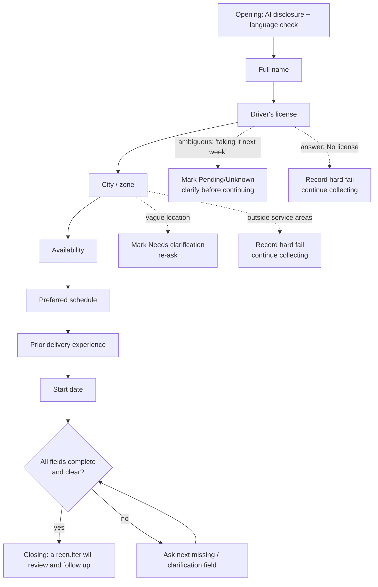

# Phase 1 — Screening Process Design

**Client:** Grupo Sazón (delivery-driver hiring, 45 locations across Spain and Mexico)
**Agent:** "Lucia", a bilingual (ES/EN) AI screening assistant that runs the first-contact
chat over a messaging channel (designed for WhatsApp), collects the seven required
screening fields, and hands a triaged, summarized candidate to a human recruiter.

**Goal.** Solve the two stated problems: (1) 60% of candidates don't answer phone calls —
so we screen asynchronously over messaging, on the candidate's schedule; (2) 80% of
recruiter time goes to unqualified candidates — so the agent collects and validates the
hard requirements up front and labels each candidate `eligible / not_eligible /
needs_review` before a human ever looks.

---

## Design principles

These four decisions shape everything below:

1. **Messaging, not a form.** Short, natural, one question at a time. The candidate can
   answer out of order, ask questions back, or switch language; the agent adapts.
2. **Deterministic flow, generative phrasing.** A rule-based layer decides *what* to ask
   next (from the current profile state); the LLM only decides *how* to phrase it. This
   keeps the screening exhaustive and predictable while the conversation stays human.
3. **The agent screens; the recruiter decides.** Lucia never accepts, rejects, or
   promises anything. Every candidate is told a recruiter will follow up. Disqualifying
   facts are recorded for the recruiter, not announced to the candidate.
4. **Collect only job-relevant basics.** No ID numbers, passport, visa, email, or phone
   are ever requested. Lucia discloses she is an AI.

---

## Conversation stages and branching logic

Lucia opens the conversation (the candidate already applied and left a number), confirms
language, then collects seven fields in a fixed order. A clarification always jumps ahead
of the next new question. One question per message; the agent never closes while any field
is missing or unclear.

**Field order:** full name → driver's license → city/zone → availability → preferred
schedule → prior delivery experience → start date.

**Branching rules:**

- **Clarifications first.** If a previously given answer is ambiguous (license `Pending`/
  `Unknown`, city `Needs clarification`), the agent resolves it before asking anything new.
- **Hard requirements never short-circuit the chat.** A "no license" or out-of-area answer
  is *recorded* as a disqualification reason, but Lucia keeps collecting the remaining
  fields and never tells the candidate they failed. Rationale: a complete profile lets the
  recruiter catch agent mistakes, re-route the candidate to a future opening or nearby
  zone, and preserves a respectful candidate experience. (Trade-off: it costs a few extra
  turns per unqualified candidate. The time saving comes from triage, not from cutting the
  chat short. An "early, graceful exit on hard fail" is a reasonable alternative we'd A/B.)
- **Out-of-order answers are absorbed.** If a candidate volunteers several fields in one
  message, all of them are extracted; the agent simply asks for whatever is still missing.
- **Candidate questions are answered, then redirected.** If the candidate asks something
  (pay, shifts, which cities), Lucia answers briefly within policy ("a recruiter will cover
  the details") and returns to the next screening question.

---

## Data fields and validation rules

| Field | Captured as | Validation / normalization | Disqualifies? |
|---|---|---|---|
| **Full name** | string | Must contain at least a first **and** last name (≥ 2 alphabetic tokens); otherwise the agent asks for the surname. | No |
| **Driver's license** | `Yes / No / Pending / Unknown` (+ raw answer kept) | Yes/no/sí variants normalized; "taking it next week" → `Pending`; EU-country licenses count as valid for Spain; car, van, and motorbike all accepted. | **`No` → disqualify** |
| **City / zone** | canonical service area (+ raw answer kept) | Must map to one of the supported areas. The LLM resolves aliases, accents, misspellings, and bilingual names (e.g. "Mexico City" → "Ciudad de Mexico"); a strict check rejects anything not on the canonical list. Vague → `Needs clarification`; clearly outside → `Unsupported`. | **`Unsupported` → disqualify** |
| **Availability** | `Full-time / Part-time / Weekends` | ES/EN synonyms normalized ("tiempo completo", "fines de semana", …). | No |
| **Preferred schedule** | `Morning / Afternoon / Evening / Flexible` | ES/EN synonyms normalized ("mañana", "tarde", "noche", …). | No |
| **Prior delivery experience** | `{ years, platform }` | "no experience" / "ninguna" → `years = 0`, platform optional and the field counts as complete; otherwise needs both a number of years and a platform (Glovo, Uber Eats, …). | No |
| **Start date** | free text | Accepts natural phrasing ("next Monday", "September", "right away"); recruiter interprets exact date. | No |

**Service areas are internal.** The supported-city list is never listed, confirmed, or
denied to the candidate — Lucia only asks where they want to work and lets the recruiter
own coverage messaging. (The demo ships a representative subset of cities standing in for
the client's 45 locations; the list is data-driven and swappable.)

**Extraction is incremental and non-destructive.** After every candidate message the full
transcript is re-read into a structured profile and *merged* with what's already known, so
a later vague answer never erases a value captured earlier. The profile also carries derived
state: `missing_fields`, `clarification_fields`, `disqualification_reasons`, `is_complete`,
`is_disqualified` — this is exactly what drives the flow logic above.

---

## Edge cases

**1. Candidate stops responding mid-conversation.**
Every turn is persisted, so a conversation can be resumed from where it stopped (via a
per-candidate link/ID) with no loss of state. Sessions that go quiet past a threshold are
surfaced to recruiters as **stale active candidates**, tagged with the stage they dropped
off at — which doubles as drop-off analytics. *Planned extension (designed, not yet built):*
an async re-engagement nudge — one friendly follow-up after ~24h and a final one after
~72h, in the candidate's language, then mark dormant. The synchronous chat has no scheduler
today, so re-engagement is currently a manual recruiter action driven by the stale list.

**2. Invalid or ambiguous answers.**
Three layers handle this. (a) *Normalization* maps the long tail of phrasings to canonical
values. (b) *Clarification state* — if an answer can't be resolved confidently (vague city,
"I'm getting my license soon"), the field is marked for clarification and the agent re-asks,
**without blaming the candidate** ("just to confirm…", never "I didn't understand you").
(c) *Strict validation* — a value that can't be mapped to an allowed option (e.g. a city not
in the service areas) is rejected rather than guessed. The agent re-asks the same field
until it's resolved and never advances past an unclear required field.

**3. Candidate switches language (ES ↔ EN).**
Lucia replies in the language of the candidate's **latest** message, defaulting to Spanish.
On code-switching within a message she follows the dominant language of that message. A
lightweight heuristic plus the model's own read drive this per turn, and the conversation's
overall language is tracked (`Spanish / English / Mixed`) for analytics. The candidate can
flip languages at any point and the agent follows without comment.

**4. Off-script / inappropriate / out-of-policy input (guardrail).**
Lucia stays on the screening task: she won't promise pay, shifts, schedules, or visa
sponsorship; won't reveal the internal service-area list; won't collect sensitive data; and
won't make or imply a hiring decision. Off-topic or inappropriate messages get a brief,
neutral redirect back to the current question.

---

## Outcomes: qualified vs. disqualified paths

The candidate experience is identical at every outcome — Lucia thanks them and says a
**recruiter will review the information and follow up**. The differentiation happens in the
recruiter-facing layer, where each finished screening gets a triage label and a summary.

| Label | When | What the recruiter sees / does |
|---|---|---|
| **`eligible`** | All fields complete and clear, no hard-rule failure. | Top of the queue — a complete profile ready for a callback. |
| **`not_eligible`** | A hard rule failed: no valid license, or location outside service areas. | Visible with the reason recorded; recruiter can confirm, reject, or keep for a future opening. Not auto-rejected. |
| **`needs_review`** | Incomplete, a field still needs clarification, extraction failed, or the transcript contradicts the extracted data. | Flagged for a human to read the transcript — the safe default whenever the agent is unsure. |

The label is computed deterministically from the profile first; the LLM then writes the
summary and may *only* move a candidate toward more caution. It can never upgrade a recorded
hard-fail to `eligible` — if model and rules disagree, the result falls back to
`needs_review`. Each finished candidate also gets a structured **HR summary**: *Candidate
Brief → Screening Facts → Conversation Notes → Follow-Up Suggestions*, written only from
transcript evidence and explicitly barred from inferring protected attributes (age,
nationality, immigration/family/health status, religion, etc.).

---

## Message tone and length guidelines

This is messaging, not email. The rules Lucia follows:

- **One short message, one question.** 1–2 sentences. No multi-question walls.
- **Acknowledge, then ask.** A brief, varied acknowledgement ("Perfecto, gracias" /
  "Great, thanks") before the next question, so it never sounds like a form.
- **Plain and human.** Everyday verbs, straight quotes, no em/en dashes. No brochure
  language, no clichés ("exciting opportunity", "dynamic team"), no chatbot filler ("Great
  question!"), no "let me walk you through" signposting.
- **Never blame the candidate** when re-asking ("just to confirm…", not "you weren't clear").
- **Light, occasional emoji** — never on every message.
- **AI disclosure up front**, and honesty about scope ("a recruiter will cover that") rather
  than guessing or over-promising.

---

## Data privacy and guardrails (summary)

- Collect only job-relevant basics; **never** ID/passport/visa/email/phone.
- Disclose that Lucia is an AI; never make or imply a hiring decision.
- No promises on pay, shifts, schedule, or sponsorship.
- Service-area list kept internal.
- Summaries are evidence-based and barred from inferring protected attributes — keeping the
  recruiter-facing output fair and defensible.
